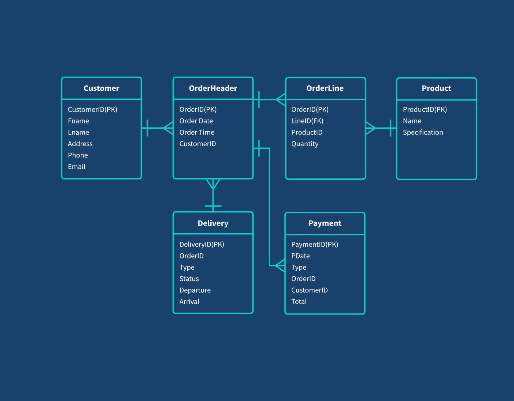

# Order Management System

Order Management System (OMS) — это система для управления заказами, предназначенная для упрощения процесса отслеживания, обработки и выполнения заказов. Система позволяет пользователям создавать и управлять заказами, отслеживать их статусы, а также управлять данными клиентов и продуктов.



## Описание

Order Management System — это мощный инструмент для управления процессами обработки заказов в бизнесе. Система предоставляет пользователям удобный интерфейс для создания заказов, отслеживания их статусов, а также получения отчетности по выполнению заказов. OMS может быть интегрирован с различными внешними системами для автоматизации процессов.

## Особенности

- Создание и редактирование заказов
- Отслеживание статусов заказов (например, в ожидании, в процессе, выполнено)
- Уведомления о изменении статусов заказов
- Управление данными клиентов и продуктов
- Простота в использовании и настройке

## Установка

1. Клонируйте репозиторий:
   ```bash
   git clone https://github.com/Nureke3/OrderManagementSystem.git
2. Создайте базу данных в PostgreSQL под названием "order_management_system"
3. Все CRUD операций доступны по адресу http://localhost:8080/{table-name's}